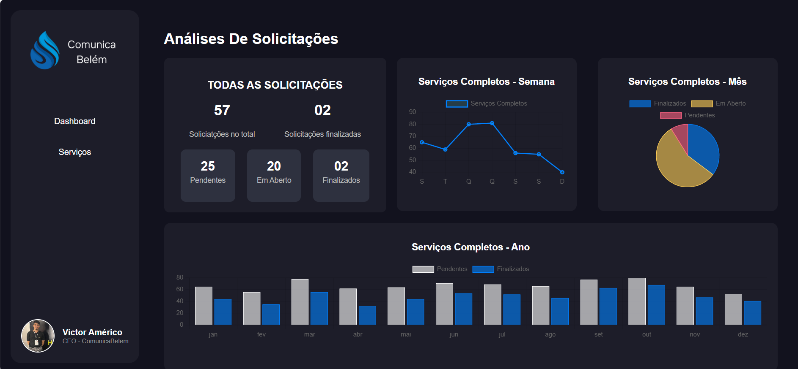
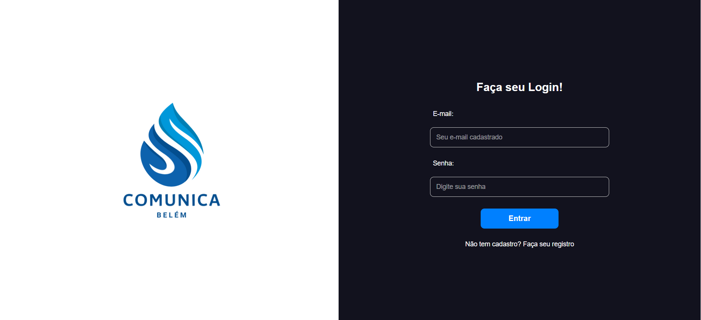
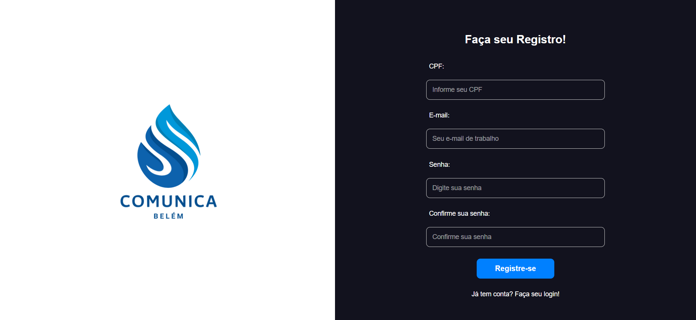
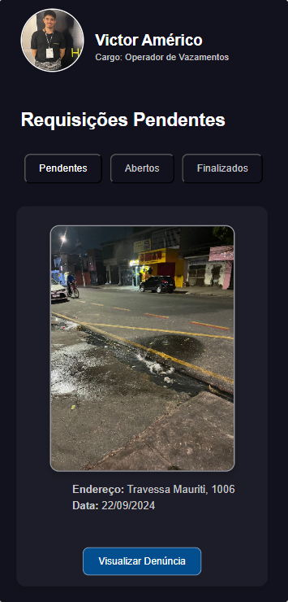
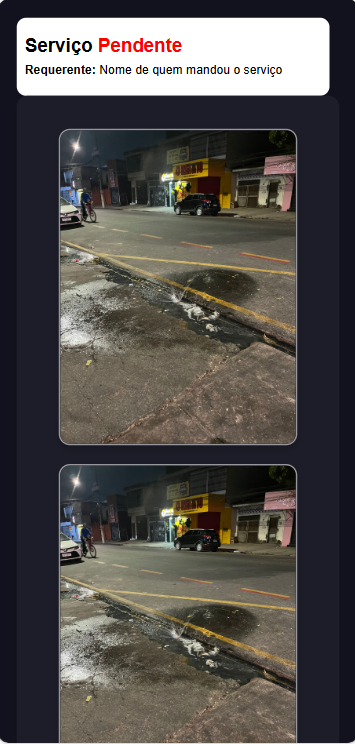
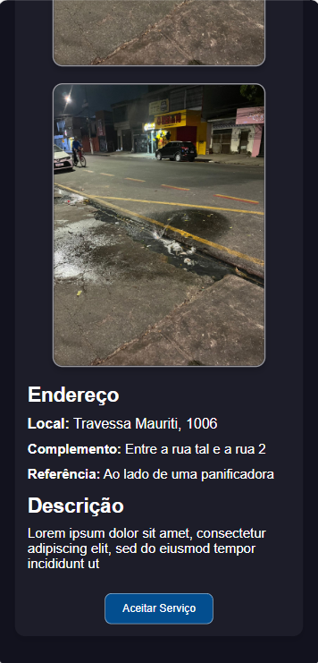
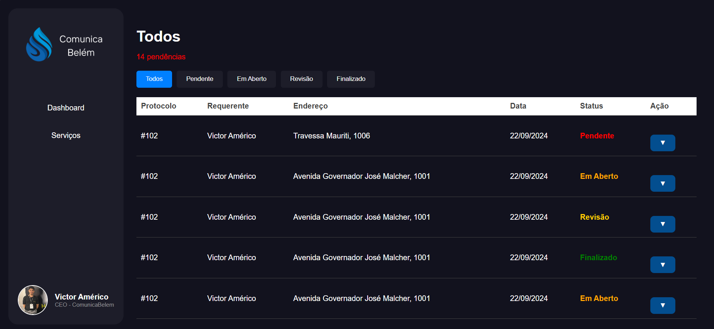
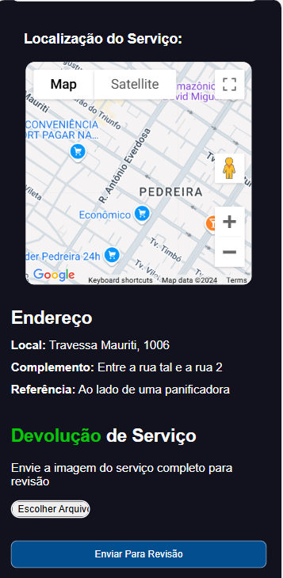
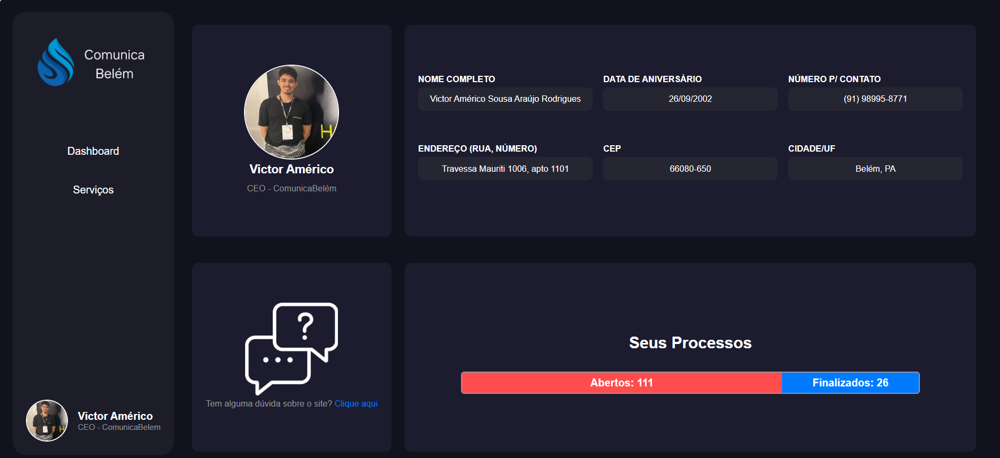

# Documentação do Projeto

ComunicaBelém é uma iniciativa inovadora desenvolvida para facilitar e otimizar a comunicação entre empresas e clientes em relação a ocorrências de vazamentos de água na cidade de Belém. O projeto surge como resposta à ausência de canais de comunicação eficazes para reportar e acompanhar essas situações, que atualmente dependem de deslocamento presencial até a companhia responsável. A plataforma ComunicaBelém oferece uma solução prática e digital, garantindo maior agilidade na resolução de problemas, promovendo transparência e fortalecendo a relação entre as partes envolvidas.

O Projeto ComunicaBelém se divide em duas frentes estratégicas: uma aplicação móvel voltada para a população de Belém, destinada ao registro de denúncias de vazamentos, e um **dashboard empresarial**, foco deste repositório. O dashboard foi desenvolvido para empresas parceiras da iniciativa, com o objetivo de permitir a visualização, gestão e priorização das denúncias recebidas. Através dessa interface, as empresas podem monitorar o volume de ocorrências e delegar as demandas para os operadores responsáveis, assegurando maior eficiência e agilidade na resolução dos problemas reportados.


## Telas do Projeto

### 1. **Dashboard**
A tela de **Dashboard** oferece uma visão geral das métricas e indicadores principais do sistema.



---

### 2. **Login**
A tela de **Login** permite que o usuário acesse o sistema com segurança.



---

### 3. **Registro**
A tela de **Registro** é usada para novos usuários se cadastrarem na plataforma.



---

### 4. **Operador**
A tela de **Operador** foi projetada para o uso específico de operadores do sistema.



---

### 5. **Serviços Pendentes**
Duas telas mostram os detalhes dos serviços pendentes e o progresso das tarefas.

- **Serviço Pendente - Parte 1**  
  

- **Serviço Pendente - Parte 2**  
  

---

### 6. **Serviços Todos**
Exibe todos os serviços listados no sistema.



---

### 7. **Enviar para Revisão**
Tela utilizada para enviar uma tarefa ou serviço para revisão interna.



---

### 8. **Usuário**
A tela de **Usuário** contém informações sobre os dados do usuário e permite ajustes no perfil.



---

## Tecnologias utilizadas

### React.Js
### Node.js
### API Maps / Google Cloud Api

## Como Executar o Projeto
1. Clone o repositório:
   ```bash
   git clone <link-do-repositorio>

2. npm install

3. npm start


